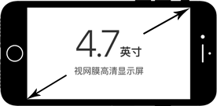

# 屏幕尺寸、像素、分辨率和dip
## 想法
最开始写页面的时候，对页面里面的px还是蛮好奇的，电脑上的分辨率好像正好跟页面渲染的宽度值对应，但手机里面却不是这样的，记得当时还去找了相关资料，好像知道是怎么回事。最近脑海里再次想起了这个问题，但已经不知道该如何表述，又没有相关的笔记，这个觉得很重要，有必要对此做个总结。
## 屏幕尺寸
屏幕尺寸是指屏幕对角线的尺寸，经常看到的描述是英寸（缩写in），1in = 2.54cm。

## 像素
像素是屏幕上图像显示的最小可控元件，它不是一个点或者一个方块，而是一个抽象的取样。每个像素都有颜色，颜色通用用3或4个分量表示，例如RGB方法用红、绿、蓝三原色的光学强度表示一种颜色，CMYK方法用青、品红、黄、黑四种颜料含量来表示一种颜色，CMYK色域在印刷行业和打印机常见。

一个像素通常被认为是数字图像中的最小单位。在不同的上下文中，像素的含义可能不同，例如视频中的像素，打印时的像素，显示屏的像素，或者数码相机（感光元素）中的像素。根据语境的不同，会有一些更为精确的同义词，例如取样点，字节，比特，超集，斑等等。

### 设备像素
设备像素是指设备中使用的物理像素。在同一设备中，像素的总数是固定的。

### CSS像素

## 分辨率

## 参考
1. https://en.wikipedia.org/wiki/Pixel
2. https://zh.wikipedia.org/wiki/%E5%83%8F%E7%B4%A0
3. https://zh.wikipedia.org/wiki/%E4%BD%8D%E5%9B%BE