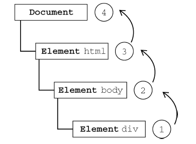
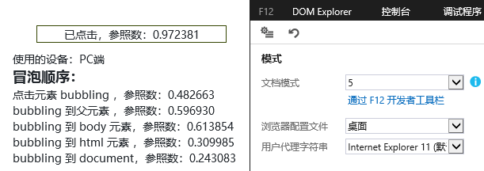
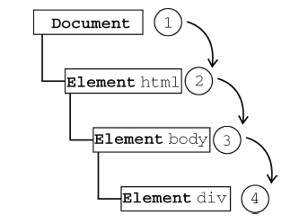
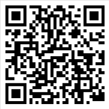
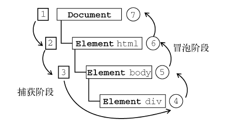
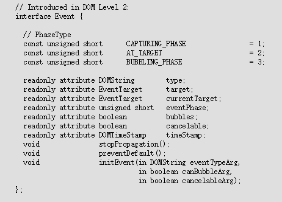
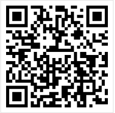

# JavaScript 事件
## 目录
- [场景](#situation)
- [事件](#event)
- [事件流](#stream)
- [事件冒泡](#bubble)
- [事件捕获](#capture)
- [DOM 事件流](#dom)
- [阻止冒泡和捕获](#prevent)
- [事件触发顺序和事件流触发顺序](#order)
- [参考资料](#reference)
## <a name="situation"></a> 场景
在最近的工作中，有2次接触到关于点击事件的问题，很快就想到了冒泡。脑海里有相关的内容，虽然解决了问题，但感觉就是说不清，也没有一个清晰的概念。翻阅了以前的笔记，发现信息不够，就更新一下笔记内容了。
## <a name="event"></a> 事件
JavaScript 与 HTML 之间的交互是通过事件实现的。事件，就是文档或浏览器窗口中发生的一些特定的交互。事件最早是在 IE3 和 Netscape Navigator 2 中出现的，当时是作为分担服务器运算负载的一种手段。在 IE4 和Navigator 4 发布时，这两种浏览器都提供了相似但不相同的 API，这些 API 并存经过了好几个主要版本。DOM2 级规范开始尝试以一种符合逻辑的方式来标准化 DOM 事件。IE9、Firefox、Opera、Safari 和 Chrome 全都已经实现了“DOM2 级事件”模块的核心部分。IE8 是最后一个仍然使用其专有事件系统的主要浏览器。

## <a name="stream"></a> 事件流
事件流描述的是从页面中接收事件的顺序。当浏览器发展到第四代时（IE4 及 Netscape Communicator 4），浏览器开发团队遇到了一个很有意思的问题：页面的哪一部分会拥有某个特定的事件？举个例子，点击一个元素时，那么算不算也点击了它的父元素。但 IE 和 Netscape 开发团队居然提出了差不多是完全相反的事件流的概念。IE 的事件流是事件冒泡流，而 Netscape Communicator 的事件流是事件捕获流。

## <a name="bubble"></a> 事件冒泡
IE 的事件流叫做事件冒泡（event bubbling），即事件开始时由最具体的元素（文档中嵌套层次最深的那个节点）接收，然后逐级向上传播到较为不具体的节点（文档）。单击一个 `div` 元素，下图为冒泡的过程。



所有现代浏览器都支持事件冒泡，但在具体实现上还是有一些差别。IE5.5 及更早版本中的事件冒泡会跳过 `<html>` 元素（从 `<body>` 直接跳到document）。IE9、Firefox、Chrome 和Safari 则将事件一直冒泡到window 对象。这是[测试页面](https://xxholic.github.io/lab/lab-js/js-click-bubbling.html)，使用 ie 的模拟器，可以发现文档模式 IE5 时，还是冒泡到了 `<html>` 元素。这个就表示怀疑了。



经过测试，模拟中 IE8 及以下都是不会冒泡到 window 对象。在安卓和 IOS 上试了几个浏览器，都会冒泡到 window 对象。扫下面二维码即可在手机查看。


## <a name="capture"></a> 事件捕获
Netscape Communicator 团队提出的另一种事件流叫做事件捕获（event capturing）。事件捕获的思想是不太具体的节点应该更早接收到事件，而最具体的节点应该最后接收到事件。事件捕获的用意在于在事件到达预定目标之前捕获它。单击一个 `div` 元素，下图为捕获的过程。



虽然事件捕获是 Netscape Communicator 唯一支持的事件流模型，但 IE9、Safari、Chrome、Opera 和 Firefox 目前也都支持这种事件流模型。尽管“DOM2 级事件”规范要求事件应该从 document 对象开始传播，但这些浏览器都是从 window 对象开始捕获事件的。由于老版本的浏览器不支持，因此很少有人使用事件捕获。建议放心地使用事件冒泡，在有特殊需要时再使用事件捕获。这是[测试页面](https://xxholic.github.io/lab/lab-js/js-click-capturing.html)，在 IE 中用模拟的方式，可以验证 IE8 及以下不支持事件捕获。在安卓和 IOS 上试了几个浏览器，支持事件捕获。扫下面二维码即可在手机查看。



## <a name="dom"></a> DOM 事件流
“DOM2 级事件”规定的事件流包括三个阶段：事件捕获阶段、处于目标阶段和事件冒泡阶段。首先发生的是事件捕获，为截获事件提供了机会。然后是实际的目标接收到事件。最后一个阶段是冒泡阶段，可以在这个阶段对事件做出响应。单击一个 `div` 元素，下图为触发事件的过程。



即使“DOM2 级事件”规范明确要求捕获阶段不会涉及事件目标，但 IE9、Safari、Chrome、Firefox 和Opera 9.5 及更高版本都会在捕获阶段触发事件对象上的事件。结果，就是有两个机会在目标对象上面操作事件。

现在问题来了：同一个元素，在冒泡和捕获阶段都绑定同一类型的事件，会如何？这是[测试页面](https://xxholic.github.io/lab/lab-js/js-click-bubbling-capturing.html)。下面为手机端浏览。


经过测试，发现绑定事件处理程序写在前面的先触发。同一事件可以绑定多个处理程序，但绑定时，如果 `addEventListener` 方法的参数相同，那么就不会重复触发多次。不同的事件处理程序，执行的顺序，跟绑定书写的顺序一致。

## <a name="prevent"></a> 阻止冒泡和捕获


在规范中可以发现，提到了想要阻止冒泡，使用 Event 接口定义中的 `stopPropagation()` 方法，除此之外还提到了阻止默认行为的 `preventDefault()` 方法。这里还可以看到一个方法 `initEvent()`，但这个方法已经从标准中删除了。

这2个方法在 IE9 以下是不支持的，需要用 IE 自己的方式进行阻止。
```javascript
Util.Event = {
  // ```
  getEvent: function(event) {
    return event ? event : window.event;
  },
  // 阻止事件传播
  stopPropagation: function(event) {
    if (event.stopPropagation){
      event.stopPropagation();
    } else {
      event.cancelBubble = true;
    }
  },
  // 阻止默认行为
  stopDefault: function(event) {
    if (event.preventDefault){
      event.preventDefault();
    } else {
      event.returnValue = false;
    }
  }
  //```
}
```
阻止冒泡的[示例](https://xxholic.github.io/lab/lab-js/js-click-stop-bubbling.html)，手机端访问如下。



阻止捕获的[示例](https://xxholic.github.io/lab/lab-js/js-click-stop-capturing.html)，手机端访问如下。


## <a name="order"></a> 2018.08.05 事件触发顺序和事件流触发顺序之间的关系
在看 fastclick.js 源码的时候，发现同一元素，绑定了不同类型的事件，且在不同阶段进行绑定。具体是在捕获阶段绑定了 click 事件，在冒泡阶段绑定了 touch 一类事件。[测试页面](https://xxholic.github.io/lab/lab-js/14/different-event.html)，扫一扫访问二维码。


结果是：touch 事件先触发，然后 click 事件再触发。上面示例还有一个现象：touch 的冒泡和捕获事件都触发完了，再触发 click 事件。由此推测，同一元素，事件类型的触发顺序优先于事件流的触发顺序，优先级高的事件，其事件流触发完了再触发优先级低的事件的事件流。然后专门对 PC 端做了一个测试，测试事件是 mouseup 和 click 事件。[测试页面](https://xxholic.github.io/lab/lab-js/14/pc-different-event.html)。结果符合推测。

这里遇到一个奇怪的现象，在 touchstart 事件执行程序里面打断点，后续应该触发的绑定事件就不会触发，没有找到原因。

## <a name="reference"></a> 参考资料
- [DOM2 Events](https://www.w3.org/TR/DOM-Level-2-Events/)
- [JavaScript高级程序设计（第3版）](https://book.douban.com/subject/10546125/)
- https://developer.mozilla.org/en-US/docs/Web/API/EventTarget/addEventListener
- https://developer.mozilla.org/en-US/docs/Web/API/EventTarget/removeEventListener
- [过时的DOM活动表](https://www.w3.org/DOM/Activity)
- https://developer.mozilla.org/zh-CN/docs/Web/API/Event/initEvent
- https://www.51-n.com/t-4203-1-1.html
- [DOM](https://dom.spec.whatwg.org/)
- [DOM Events](https://dom.spec.whatwg.org/#introduction-to-dom-events)
- [Event](https://dom.spec.whatwg.org/#concept-event)