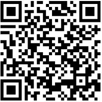
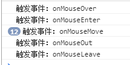
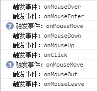
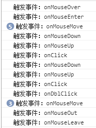
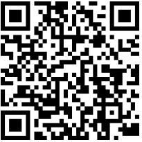
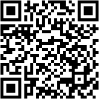
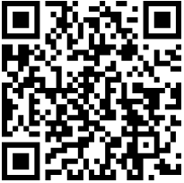
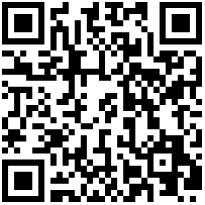
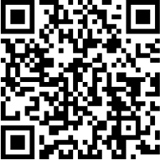

# Mouse Events & Touch Events
## 场景
在探索了 JavaScript 事件之后，紧接着就对移动端的点击事件进行进一步了解。由于点击延迟 300 毫秒，除了各厂商给出的解决方案，在程序方面也有对应的解决方案，于是选取了几种进行对比查看。在查看源码的过程中，发现了关于事件执行顺序的问题。觉得有必要对点击相关事件的执行顺序，进行一次更全面一些的探索。

## Mouse Events 和 Touch Events
### Mouse Events (鼠标事件)
常用的鼠标事件如下：
- click
- dblclick
- mousedown
- **mouseenter**
- **mouseleave**
- mousemove
- mouseover
- mouseout
- mouseup

对于这些有几点说明：
1. mouseenter 事件类似于 mouseover 事件。 唯一的区别是 mouseenter 事件不支持冒泡 。
2. mouseleave 事件类似于 mouseout 事件。 唯一的区别是 mouseleave 事件不支持冒泡。
3. 以上对应的 HTML 事件属性可用于所有 HTML 元素，除了以下标签
```html
<base>、<bdo>、<br>、<head>、<html>、<iframe>、<meta>、<param>、<script>、<style>、<title>
```

第3条之前一直没有注意过，但个人没有在规范里找到，只是找到了一个 [Note](https://www.w3.org/TR/2017/REC-html52-20171214/dom.html#global-attributes)：虽然这些属性都可以应用到所有的元素，但并不是所有的属性都会有效。于是就亲自验证一下最常见的 onclick 属性。这个[测试页面](https://xxholic.github.io/lab/lab-js/15/html-event-support.html)，手机端访问如下。



测试结果就是：html、base、bdo 标签支持 onclick 属性并有效。所以第 3 条的说法有问题，如果有使用需求，需要注意。

### Touch Events (触摸事件)
触摸事件如下：
- touchstart
- touchend
- touchmove
- touchcancel

在规范里面找到了一张图，很清晰的说明了一些特性，如下图。


## 事件触发顺序
以下的测试验证，是针对同一个元素的事件触发顺序。
### PC端
这是[测试页面](https://xxholic.github.io/lab/lab-js/15/event-order.html)。
#### 不点击的情况下
正常“移入 -> 离开”触发的顺序：

mouseover -> mouseenter -> mousemove -> mouseout -> mouseleave。



#### 点击的情况下
正常“移入 -> 单击 -> 离开”触发顺序：

mouseover -> mouseenter -> mousemove -> mousedown -> mouseup -> click -> mousemove -> mouseout -> mouseleave。



#### 双击的情况下
正常“移入 -> 双击 -> 离开”触发顺序：

mouseover -> mouseenter -> mousemove -> mousedown -> mouseup -> click -> mousedown -> mouseup -> click -> dblclick -> mousemove -> mouseout -> mouseleave。



### 手机端
手机端访问如下。


#### 正常单击的情况
如果上面所列的鼠标事件和触摸事件都绑定了，那么顺序就是这样的：

*IOS：*

touchstart -> touchend -> mouseover -> mouseenter -> mousemove。

IOS 里面 click 事件没有触发，网上那么多写的什么触发了 touchstart，事件流会继续下去，这是什么情况？在前面介绍触摸事件的时候，可以看到touchend后面对应的 Default Action 有 mousemove、 mousedown、 mouseup、click，猜测是只会按顺序触发其中的一种，不会都触发。做了下面的测试。

只绑定了 click、 dblclick 事件情况。



只绑定了 mousemove、click、dblclick 事件情况。



只绑定了 mousedown、click、dblclick 事件情况。



只绑定了 mouseup、click、dblclick 事件情况。



发现在 IOS 里面如果绑定了 mousemove 事件，click 事件就不会触发。不会触发 dblclick 事件。

*Android:*

touchstart -> touchend -> mouseover -> mouseenter -> mousemove -> mousedown -> mouseup -> click。

*共同点：*
- mouseover 第一次点击的时候会触发，紧接着继续点击第二次的时候就不会触发。当点了该元素之外的区域，再次点击的时候，又会触发。换个说法，就是类似再次“获取焦点”的时候就会触发该事件。
- 点击很快的时候，click 可能会连续重复执行，而不是每次从 touchstart 开始。

#### 快速多次点击的情况
*IOS：*

跟正常单击的情况一致。

*Android:*

touchstart -> touchend -> mouseover -> mouseenter -> mousemove -> mousedown -> mouseup -> click -> touchstart -> touchend ->  mousemove -> mousedown -> mouseup -> click -> dblclick。

## 最后说一些
大部分的情况还是比较容易理解。上面进行验证的是比较正常的情况，目前足够帮助自己进行其它的探索。一些相对不正常的情况，要同时绑定很多事件并触发，一般不会这么做。如果实际中有碰到，会再进行补充。

## 参考资料
- [Global-attributes](https://www.w3.org/TR/2017/REC-html52-20171214/dom.html#global-attributes)
- [MDN Touch](https://developer.mozilla.org/en-US/docs/Web/API/Touch)
- [touch-interface](https://www.w3.org/TR/touch-events/#touch-interface)
- [dom events](https://dom.spec.whatwg.org/#introduction-to-dom-events)