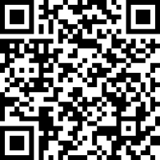

# 手机端点击事件
## 想法
现在是移动先行的时代，手机端的处理变得越来越重要。在事件方面，感觉点击是用的最多的，由于移动端点击事件的一些特殊性，对点击事件的封装也是有好几种，对此，想看看他们的封装到底有什么不一样。

## 点击的问题
很容易让人想到的是点击延迟的问题，详情见[移动端 Click 300 毫秒延迟的问题](https://github.com/XXHolic/segment/issues/8)，由于这个就会产生“点透”的现象，这么来说其实还是有些模糊，查询了网上关于这样的一些文章，发现这个“点透”现象，基本都是因为同一个点击效果，去绑定了不同类型的事件。例如一个元素绑定了click事件，另外一个原始绑定了touch事件，两个元素触发区域重合了，由于事件先后执行是有一定顺序，这样就“点透”了。这个是[click点透示例](https://xxholic.github.io/lab/lab-js/19/click-penetrate.html)。扫一扫访问如下。

想想这种现象的起因，感觉有些奇怪，这种点击效果在一个系统里面，为什么不用统一的点击事件，感觉从一开始是可以进行一定的预防。
## 点击封装几个插件
### fastclick
整体的实现思路：

在目标元素尽量外层的元素 A（建议是 body 元素）上，用 fastclick 进行初始化并对元素A注册相关事件处理程序。目标元素注册了click事件处理程序，在触发的时候，元素A中相关的事件会先触发，进行相关的判断处理后，会模拟一个目标元素的click事件并主动触发，这样子就减少了延迟。

下面说一下
初始化时，主要注册的事件 click、touchstart、touchmove、touchend、touchcancel，其中 click 事件处理程序捕获阶段注册，其余事件在冒泡阶段注册。目标元素注册了click事件处理程序，然后触发的时候，首先触发的是A的touchstart事件，主要的作用是记录点击的位置和防止快速双击。有触发的时候，实际上是先触发body的touch事件，然后在相关的touch事件里面进行判断处理，最后在touchend里面模拟目前元素的事件，然后触发模拟事件。

几个关键的事件处理：
在构造函数中，监听的事件有 click、touchstart、touchmove、touchend、touchcancel、mouseover、mousedown、mouseup，其中mouseover、mousedown、mouseup是针对安卓系统，在捕获阶段调用事件处理程序的有click、mouseover、mousedown、mouseup，其余的在冒泡阶段调用事件处理程序。

当在手机端正常点击的时候，触发的事件顺序是touchstart->touchend->click，在 touchstart 处理程序中，主要的逻辑有：
1. 判断是否是多点触摸，如果是，就直接结束
2. 将 trackingClick 置为 true，表示点击已被跟踪，trackingClickStart、targetElement、touchStartX、touchStartY分别都进行赋值。

在 touchend 处理程序里种，主要的逻辑有：

几个比较重要的属性有：
- trackingClick：标记一个点击是否被跟踪
- trackingClickStart：点击开始时的时间戳
- targetElement：被点击的元素
- touchStartX：触摸的X坐标，touchStartY：触摸的Y坐标
### hammer
### zepto
### jquery-mobile

## 相关资料
- [Touch](https://developer.mozilla.org/en-US/docs/Web/API/Touch)
- http://smashinghub.com/10-best-mobile-touch-javascript-framework.htm
- https://www.zhangxinxu.com/wordpress/2012/04/js-dom%E8%87%AA%E5%AE%9A%E4%B9%89%E4%BA%8B%E4%BB%B6/